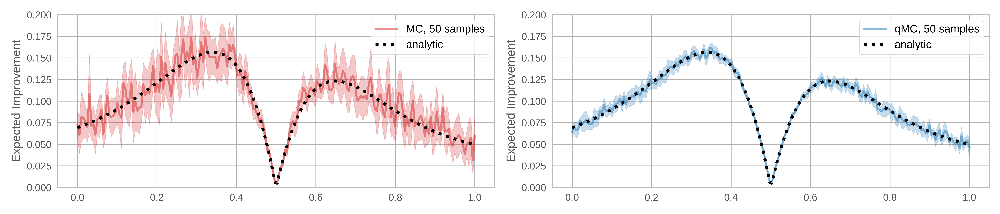
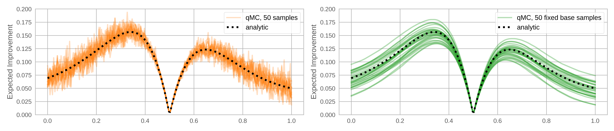

Acquisition functions are heuristics employed to evaluate the usefulness of one
of more design points for achieving the objective of maximizing the underlying
black box function.

BoTorch supports both analytic as well as (quasi-) Monte-Carlo based acquisition
functions. It provides a generic
[`AcquisitionFunction`](https://botorch.readthedocs.io/en/latest/acquisition.html#botorch.acquisition.acquisition.AcquisitionFunction) API that
abstracts away from the particular type, so that optimization can be performed
on the same objects.

## Monte Carlo Acquisition Functions

Many common acquisition functions can be expressed as the expectation of some
real-valued function of the model output(s) at the design point(s):

$$
\alpha(X) = \mathbb{E}\bigl[ a(\xi) \mid
  \xi \sim \mathbb{P}(f(X) \mid \mathcal{D}) \bigr]
$$

where $X = (x_1, \dotsc, x_q)$, and $\mathbb{P}(f(X) \mid \mathcal{D})$ is the
posterior distribution of the function $f$ at $X$ given the data $\mathcal{D}$
observed so far.

Evaluating the acquisition function thus requires evaluating an integral over
the posterior distribution. In most cases, this is analytically intractable. In
particular, analytic expressions generally do not exist for batch acquisition
functions that consider multiple design points jointly (i.e. $q > 1$).

An alternative is to use Monte-Carlo (MC) sampling to approximate the integrals.
An MC approximation of $\alpha$ at $X$ using $N$ MC samples is

$$
\alpha(X) \approx \frac{1}{N} \sum_{i=1}^N a(\xi_{i})
$$

where $\xi_i \sim \mathbb{P}(f(X) \mid \mathcal{D})$.

For instance, for q-Expected Improvement (qEI), we have:

$$
\text{qEI}(X) \approx \frac{1}{N} \sum_{i=1}^N \max_{j=1,..., q}
\bigl\{ \max(\xi_{ij} - f^*, 0) \bigr\},
\qquad \xi_{i} \sim \mathbb{P}(f(X) \mid \mathcal{D})
$$

where $f^*$ is the best function value observed so far (assuming noiseless
observations). Using the reparameterization trick ([^KingmaWelling2014],
[^Rezende2014]),

$$
\text{qEI}(X) \approx \frac{1}{N} \sum_{i=1}^N \max_{j=1,..., q}
\bigl\{ \max\bigl( \mu(X)\_j + (L(X) \epsilon_i)\_j - f^*, 0 \bigr) \bigr\},
\qquad \epsilon_{i} \sim \mathcal{N}(0, I)
$$

where $\mu(X)$ is the posterior mean of $f$ at $X$, and $L(X)L(X)^T = \Sigma(X)$
is a root decomposition of the posterior covariance matrix.

All MC-based acquisition functions in BoTorch are derived from
[`MCAcquisitionFunction`](https://botorch.readthedocs.io/en/latest/acquisition.html#botorch.acquisition.monte_carlo.MCAcquisitionFunction).

Acquisition functions expect input tensors $X$ of shape
$\textit{batch\_shape} \times q \times d$, where $d$ is the dimension of the
feature space, $q$ is the number of points considered jointly, and
$\textit{batch\_shape}$ is the batch-shape of the input tensor. The output
$\alpha(X)$ will have shape $\textit{batch\_shape}$, with each element
corresponding to the respective $q \times d$ batch tensor in the input $X$.
Note that for analytic acquisition functions, it must be that $q=1$.

### MC, q-MC, and Fixed Base Samples

BoTorch relies on the re-parameterization trick and (quasi)-Monte-Carlo sampling
for optimization and estimation of the batch acquisition functions [^Wilson2017].
The results below show the reduced variance when estimating an expected
improvement (EI) acquisition function using base samples obtained via quasi-MC
sampling versus standard MC sampling.

In the plots above, the base samples used to estimate each point are resampled.
As discussed in the [Overview](./overview), a single set of base samples can be
used for optimization when the re-parameterization trick is employed. What are the
trade-offs between using a fixed set of base samples versus re-sampling on every
MC evaluation of the acquisition function? Below, we show that fixing base samples
produces functions that are potentially much easier to optimize, without resorting to
stochastic optimization methods.

If the base samples are fixed, the problem of optimizing the acquisition function
is deterministic, allowing for conventional quasi-second order methods such as
L-BFGS or sequential least-squares programming (SLSQP) to be used. These have
faster convergence rates than first-order methods and can speed up acquisition
function optimization significantly.

One concern is that the approximated acquisition function is *biased* for any
fixed set of base samples, which may adversely affect the solution. However, we
find that in practice, both the optimal value and the optimal solution of these
biased problems for standard acquisition functions converge quite rapidly to
their true counterparts as more samples are used. Note that for evaluation of
the acquisition function we integrate over a $qo$-dimensional space (where
$q$ is the number of points in the q-batch and $o$ is the number of outputs
included in the objective). Therefore, the MC integration problem can be quite
low-dimensional even for models on high-dimensional feature spaces (large $d$).
Because using additional samples is relatively cheap computationally,
we default to 500 base samples in the MC acquisition functions.

On the other hand, when re-sampling is used in conjunction with a stochastic
optimization algorithm, the kind of bias noted above is no longer a concern.
The trade-off here is that the optimization may be less effective, as discussed
above.

## Analytic Acquisition Functions

BoTorch also provides implementations of analytic acquisition functions that
do not depend on MC sampling. These acquisition functions are subclasses of
[`AnalyticAcquisitionFunction`](https://botorch.readthedocs.io/en/latest/acquisition.html#botorch.acquisition.analytic.AnalyticAcquisitionFunction)
and only exist for the case of a single candidate point ($q = 1$). These
include classical acquisition functions such as Expected Improvement (EI),
Upper Confidence Bound (UCB), and Probability of Improvement (PI). An example
comparing [`ExpectedImprovement`](https://botorch.readthedocs.io/en/latest/acquisition.html#botorch.acquisition.analytic.ExpectedImprovement),
the analytic version of EI, to it's MC counterpart
[`qExpectedImprovement`](https://botorch.readthedocs.io/en/latest/acquisition.html#botorch.acquisition.monte_carlo.qExpectedImprovement)
can be found in
[this tutorial](tutorials/compare_mc_analytic_acquisition).

Analytic acquisition functions allow for an explicit expression in terms of the
summary statistics of the posterior distribution at the evaluated point(s).
A popular acquisition function is Expected Improvement of a single point
for a Gaussian posterior, given by

$$
\text{EI}(x) = \mathbb{E}\bigl[
\max(y - f^*, 0) \mid y\sim \mathcal{N}(\mu(x), \sigma^2(x))
\bigr]
$$

where $\mu(x)$ and $\sigma(x)$ are the posterior mean and variance of $f$ at the
point $x$, and $f^*$ is again the best function value observed so far (assuming
noiseless observations). It can be shown that

$$
\text{EI}(x) = \sigma(x) \bigl( z \Phi(z) + \varphi(z) \bigr)
$$

where $z = \frac{\mu(x) - f_{\max}}{\sigma(x)}$ and $\Phi$ and $\varphi$ are
the cdf and pdf of the standard normal distribution, respectively.

With some additional work, it is also possible to express the gradient of
the Expected Improvement with respect to the design $x$. Classic Bayesian
Optimization software will implement this gradient function explicitly, so that
it can be used for numerically optimizing the acquisition function.

BoTorch, in contrast, harnesses PyTorch's automatic differentiation feature
("autograd") in order to obtain gradients of acquisition functions. This makes
implementing new acquisition functions much less cumbersome, as it does not
require to analytically derive gradients. All that is required is that the
operations performed in the acquisition function computation allow for the
back-propagation of gradient information through the posterior and the model.

[^KingmaWelling2014]: D. P. Kingma, M. Welling. Auto-Encoding Variational Bayes.
ICLR, 2013.

[^Rezende2014]: D. J. Rezende, S. Mohamed, D. Wierstra. Stochastic
Backpropagation and Approximate Inference in Deep Generative Models. ICML, 2014.

[^Wilson2017]: J. T. Wilson, R. Moriconi, F. Hutter, M. P. Deisenroth.
The Reparameterization Trick for Acquisition Functions. NeurIPS Workshop on
Bayesian Optimization, 2017.
