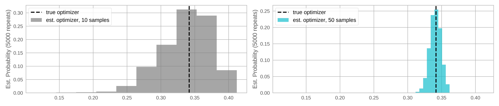
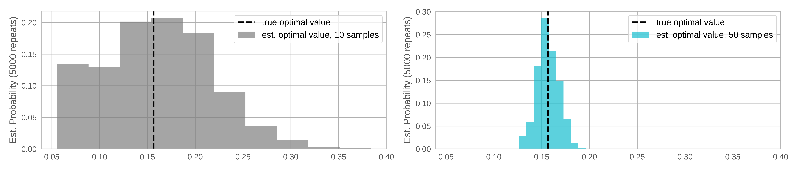

## Monte Carlo (MC) evaluation of q-batch acquisition functions

Many common acquisition functions can be expressed as the expectation of some
real-valued function of the model output(s) at the design point(s):

$$ H(X) = \mathbb{E}\bigl[ h(Y) \mid Y \sim \mathbb{P}_Y(X) \bigr] $$

Here $\mathbb{P}_Y(X)$ is the posterior distribution of $Y$ given $X$.

Evaluating the acquisition function thus requires evaluating an integral over
the posterior distribution. In most cases, this is analytically intractable (in
particular, analytic expressions generally do not exist for `q > 1`).

An alternative is to use Monte-Carlo (MC) sampling to approximate the integrals.
An MC approximation of $H$ at $X$ using $N$ MC samples is

$$ H(X) \approx \frac{1}{N} \sum_{j=1}^N h(y_j) $$

where $y_j \sim \mathbb{P}_Y(X)$.

botorch relies on the re-parameterization trick ([^KingmaWelling2014], [^Rezende2014])
and (quasi)-MC sampling for optimization and estimation of the batch acquisition functions [^Wilson2017].
 The plots below show the reduced variance when estimating an expected improvement (EI) acquisition function using base
samples obtained via quasi-MC sampling versus standard MC sampling.

In the plots above, the base samples used to estimate each point are resampled.
As discussed in the [overview](./overview), a single set of base samples can be
used for optimization when the re-parameterization trick is employed. What are the
trade-offs between using a fixed set of base samples versus re-sampling on every
MC evaluation of the acquisition function? Below, we show that fixing base samples
produces functions that are potentially much easier to optimize, without resorting to
stochastic optimization methods.

If the base samples are fixed, the problem of optimizing the acquisition function
is deterministic, allowing for conventional quasi-second order methods to be used (e.g., `L-BFGS` or sequential
least-squares programming `SLSQP`). These have faster convergence rates than first-order
methods and can speed up acquisition function optimization significantly.

The concern, however, is that the approximated acquisition function is *biased* for any
fixed set of base samples, which may adversely affect the solution. Fortunately, experiments
on synthetic functions show that both the optimal value and optimal solution quickly become
quite robust to this bias as more samples are used. The plots below compare the distribution of optimal values and optimizer locations
for 10 and 50 quasi-MC samples.

On the other hand, when re-sampling is used in conjunction with a stochastic
optimization algorithm, bias is no longer a concern. The trade-off here is that
the optimization may be less effective, as discussed above.

[^KingmaWelling2014]: D. P. Kingma, M. Welling. Auto-Encoding Variational Bayes.
ICLR, 2013.

[^Rezende2014]: D. J. Rezende, S. Mohamed, D. Wierstra. Stochastic
Backpropagation and Approximate Inference in Deep Generative Models. ICML, 2014.

[^Wilson2017]: J. T. Wilson, R. Moriconi, F. Hutter, M. P. Deisenroth. The Reparameterization Trick for Acquisition Functions. NeurIPS Workshop on Bayesian Optimization, 2017.

## Analytic Acquisition Functions

botorch also provides implementations of analytic acquisition functions that
do not depend on MC sampling. These acquisition functions are subclasses of
`AnalyticAcquisitionFunction` and only exist for the case of a single candidate point (`q = 1`). These
include classical acquisition functions such as Expected Improvement (EI),
Upper Confidence Bound (UCB), and Probability of Improvement (PI). An example
comparing the analytic version of EI `ExpectedImprovement` to the MC version
`qExpectedImprovement` can be found in [this tutorial](../tutorials/compare_mc_analytic_acquisition).

Analytic acquisition functions allow for an explicit expression in terms of the
summary statistics of the posterior distribution at the evaluated point(s).
A classic such acquisition function is Expected Improvement of a single point
for a Gaussian posterior, given by

$$ \text{EI}(x) = \mathbb{E}\bigl[
\max(y - f_{max}, 0) \mid y\sim \mathcal{N}(\mu(x), \sigma^2(x))
\bigr] $$

where $\mu(x)$ and $\sigma(x)$ are the posterior mean and variance of $f$ at the
point $x$, and $f_{max}$ is the best function value observed so far (assuming
noiseless observations). It can be shown that

$$ \text{EI}(x) = \sigma(x) \bigl( z \Phi(z) + \varphi(z) \bigr)$$

where $z = \frac{\mu(x) - f_{\max}}{\sigma(x)}$ and $\Phi$ and $\varphi$ are
the cdf and pdf of the standard Normal distribution, respectively.

With some additional work, it is also possible to express the gradient of
the Expected Improvement with respect to the design $x$. Classic Bayesian
Optimization software will implement this gradient function explicitly, so that
it can be used for numerically optimizing the acquisition function.

botorch, in contrast, harnesses PyTorch's automatic differentiation feature
("autograd") in order to obtain gradients of acquisition functions. This makes
implementing new acquisition functions much less cumbersome, as it does not
require to analytically derive gradients. All that is required is that the
operations performed in the acquisition function computation allow for the
back-propagation of gradient information through the posterior and the model.
