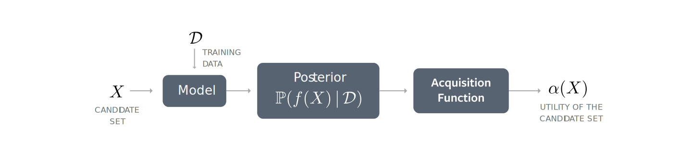

This overview describes the basic components of BoTorch and how they work
together. For a high-level view of what BoTorch tries to achieve in more
abstract terms, please see the [Introduction](introduction).

## Black-Box Optimization

At a high level, the problem underlying Bayesian Optimization (BayesOpt) is to
maximize some expensive-to-evaluate black box function $f$. In other words, we
do not have access to the functional form of $f$ and our only recourse is to
evaluate $f$ at a sequence of test points, with the hope of determining a
near-optimal value after a small number of evaluations. In many settings,
the function values are not observed exactly, and only noisy observations are
available

Bayesian Optimization is a general approach to adaptively select these test
points (or batches of test points to be evaluated in parallel) that allows for
a principled trade-off between evaluating $f$ in regions of good observed
performance and regions of high uncertainty.

## Bayesian Optimization

### Models

In order to optimize $f$ within a small number of evaluations, we need a way of
extrapolating our belief about what $f$ looks like at points we have not yet
evaluated. In Bayesian Optimization, this is referred to as the
*surrogate model*.
Importantly, the surrogate model should be able to quantify the uncertainty
of its predictions in form of a **posterior** distribution over function values
$f(x)$ at points $x$.

The surrogate model for $f$ is typically a Gaussian Process (GP), in which case
the posterior distribution on any finite collection of points is a multivariate
normal distribution. A GP is specified by a mean function $\mu(x)$ and a
covariance kernel $k(x, x')$, from which a mean vector
$(\mu(x_0), \ldots, \mu(x_k))$
and covariance matrix $\Sigma$ with $\Sigma_{ij} = k(x_i, x_j)$ can be computed
for any set of points $(x_1, \ldots x_k)$. Using a GP surrogate model for $f$
means that we assume $(f(x_1), \ldots, f(x_k))$ is multivariate normal with a
mean vector and covariance matrix determined by $\mu(x)$ and $k(x, x')$.

BoTorch provides first-class support for [GPyTorch](https://gpytorch.ai/),
a package for scalable GPs and Bayesian deep learning implemented in PyTorch.

While GPs have been a very successful modeling approach, BoTorch's support for
MC-sampling based acquisition functions makes it straightforward to also use
other model types. In particular, BoTorch makes no particular assumptions
on what kind of model is being used, so long as is able to produce samples from
a posterior over outputs given an input $x$. See [Models](models) for
more details on models in BoTorch.

### Posteriors

Posteriors represent the "belief" a model has about the function values at a
point (or set of points), based on the data it has been trained with. That is,
the posterior distribution over the outputs conditional on the data observed
so far.

When using a GP model, the posterior is given explicitly as a multivariate
Gaussian (fully parameterized by its mean and covariance matrix).
In other cases, the posterior may be implicit in the model and not easily
described by a small set of parameters.

BoTorch abstracts away from the particular form of the posterior by providing a
simple `Posterior` API that only requires implementing an `rsample()` method for
sampling from the posterior. For more details, please see
[Posteriors](posteriors).

### Acquisition Functions

Acquisition functions are heuristics employed to evaluate the usefulness of one
of more design points for achieving the objective of maximizing the underlying
black box function.

Some of these acquisition functions have closed-form solutions under Gaussian
posteriors, but many of them (especially when assessing the joint value of
multiple points in parallel) do not. In the latter case, one can resort to using
Monte-Carlo (MC) sampling in order to approximate the acquisition function.

BoTorch supports both analytic as well as (quasi-) Monte-Carlo based acquisition
functions. It provides an `AcquisitionFunction` API that abstracts away from the
particular type, so that optimization can be performed on the same objects.
Please see [Acquisition Functions](acquisition) for additional information.

#### Evaluating Monte-Carlo Acquisition Functions

The idea behind using Monte-Carlo sampling for evaluating acquisition functions
is simple: instead of computing an (intractable) expectation over the
posterior, we sample from the posterior and use the sample average as an
approximation.

#### Objectives

To give additional flexibility in the case of MC-based acquisition functions,
BoTorch provides the option of transforming the output(s) of the model through
an `Objective` module, which returns a one-dimensional output that is passed to
the acquisition function. The `MCAcquisitionFunction` class defaults its
objective to `IdentityMCObjective`, which simply returns the last dimension of
the model output. Thus, for the standard use case of a single-output GP that
directly models the black box function $f$, no special objective is required.
For more details on the advanced features enabled by the `Objective`, see
[Objectives](objectives).

## The Re-Parameterization Trick

The re-parameterization trick (see e.g. [^KingmaWelling2014], [^Rezende2014])
can be used to write the posterior distribution as a deterministic
transformation of an auxiliary random variable $\epsilon$. For example, a
normally distributed random variable $X$ with mean $\mu$ and standard deviation
$\sigma$ has the same distribution as $\mu + \sigma \epsilon$ where $\epsilon$
is a standard normal. Therefore, an expectation with respect to $X$ can be
approximated using samples from $\epsilon$. In the case where $\mu$ and $\sigma$
are parameters of an optimization problem, MC approximations of the objective at
different values of $\mu$ and $\sigma$ can be computed using a single set of
"base samples." Importantly, a re-parameterization of this kind allows for
back-propagation of gradients through the samples, which enables auto-
differentiation of MC-based acquisition functions with respect to the
candidate points.

In BoTorch, base samples are constructed using an `MCSampler` object, which
provides an interface that allows for different sampling techniques.
`IIDNormalSampler` utilizes independent standard normal draws, while
`SobolQMCNormalSampler` uses quasi-random, low-discrepancy "Sobol" sequences as
uniform samples which are then transformed to construct quasi-normal samples.
Sobol sequences are more evenly distributed than i.i.d. uniform samples and tend
to improve the convergence rate of MC estimates of integrals/expectations.
We find that Sobol sequences substantially improve the performance of MC-based
acquisition functions, and so `SobolQMCNormalSampler` is used by default.
For more details, see [Monte-Carlo Samplers](samplers.md).

[^KingmaWelling2014]: D. P. Kingma, M. Welling. Auto-Encoding Variational Bayes.
ICLR, 2013.

[^Rezende2014]: D. J. Rezende, S. Mohamed, D. Wierstra. Stochastic
Backpropagation and Approximate Inference in Deep Generative Models. ICML, 2014.
